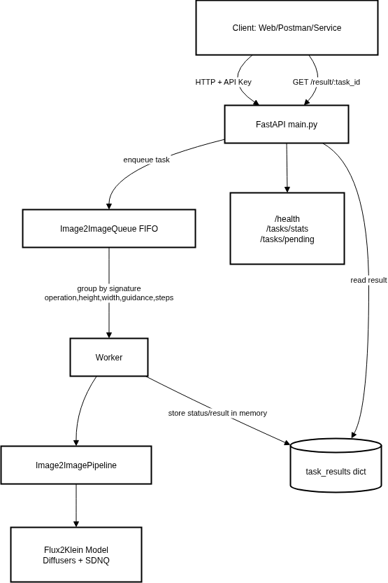

# Image2Image GenAI Service (FLUX.2)

Dự án cung cấp REST API cho tác vụ Image-to-Image sử dụng mô hình mã nguồn mở dựa trên cấu trúc FLUX. Service được xây dựng bằng **FastAPI**, hỗ trợ xử lý hàng đợi (Queue) bất đồng bộ, gom cụm (batch) các yêu cầu để tối ưu suy luận trên GPU.

## 🌟 Tính Năng Chính
- **Generate AI Image**: Tạo ảnh từ văn bản (`prompt`).
- **Edit AI Image**: Chỉnh sửa ảnh từ một ảnh gốc và văn bản (`prompt` + `image`).
- **Batch Processing Queue**: Cơ chế gom cụm (Batch processing) linh hoạt giúp tăng cường hiệu suất GPU.
- **REST API & API Key Security**: Giao tiếp chuẩn REST được bảo vệ với xác thực API Key.
---

## 📂 Cấu Trúc Thư Mục

```text
.
├── main.py                 # File chạy chính (điểm vào API)
├── src/                    # Chứa mã nguồn chính
│   ├── inference.py        # Logic load model FLUX và inference
│   ├── queue_img2img.py    # Logic hàng đợi FIFO xử lý batch
│   ├── constant.py         # Biến môi trường và cấu hình hệ thống
│   ├── schemas/            # Pydantic schemas cho API
│   └── utils/              # Các tiện ích (logger, security, ...)
├── models/                 # Thư mục lưu trữ model được tải về
├── tests/                  # Kịch bản kiểm thử (stress test, API test)
├── requirements.txt        # Danh sách thư viện phụ thuộc
└── start_img2img.sh        # Script khởi chạy nhanh qua tmux
```

---

## 🏗 Kiến Trúc Hệ Thống

Kiến trúc hiện tại được thiết kế theo mô hình xử lý bất đồng bộ (Non-blocking Queue Processing).

```
flowchart LR
    U[Client: Web/Postman/Service] -->|HTTP + API Key| A[FastAPI main.py]
    A -->|enqueue task| Q[Image2ImageQueue FIFO]
    Q -->|group by signature\noperation,height,width,guidance,steps| W[Worker]
    W --> P[Image2ImagePipeline]
    P --> M[Flux2Klein Model\nDiffusers + SDNQ]
    W -->|store status/result in memory| R[(task_results dict)]
    U -->|GET /result/{task_id}| A
    A -->|read result| R
    A --> H[/health, /tasks/stats, /tasks/pending]
```



---

## 🚀 Hướng Dẫn Cài Đặt và Chạy

### 1. Yêu cầu hệ thống
- **Python:** 3.10+ (Khuyến nghị Python 3.13)
- **CUDA:** Tương thích Torch+CUDA để suy luận GPU.
- **GPU (VRAM):** Đã kiểm thử trơn tru trên **NVIDIA RTX A4000** (yêu cầu tối thiểu 16GB VRAM để tải model FLUX 4bit + batch processing).
- **RAM Server:** Tối thiểu **24GB**.

### 2. Tải Model

Trước khi chạy lần đầu, hãy tải model (Flux2Klein 9B) về thư mục local theo lệnh sau:
```bash
# Tải về bằng huggingface-cli
hf download Disty0/FLUX.2-klein-9B-SDNQ-4bit-dynamic-svd-r32 --local-dir models/flux_model
```

### 3. Cài Đặt Môi Trường (Local)

Cài đặt các thư viện cần thiết:
```bash
pip install -r requirements.txt
pip install -q git+https://github.com/huggingface/diffusers.git
```

### 4. Khởi Chạy Server

Chạy server bằng Python thuần hoặc thông qua `start_img2img.sh` daemon tmux:
```bash
# Khởi chạy daemon qua tmux (như được cung cấp trong file bash)
./start_img2img.sh

# Hoặc khởi động server trực tiếp qua python
python main.py

# Hoặc chạy thông qua uvicorn nếu cần
uvicorn main:app --host 0.0.0.0 --port 8060 --reload
```

---

## 📡 API Endpoints

Tất cả các endpoint phục vụ tại route `root_path=/api/v1` và yêu cầu chứng thực qua Header:
* **Header Key:** `X-IMG2IMG-KEY`
* **Header Value:** `<Giá trị cấu hình API Key của bạn>`

### 1. Healthcheck và Metrics
- **[GET] `/health`**: Kiểm tra trạng thái hoạt động của Service.
- **[GET] `/tasks/pending`**: Trả về số lượng các requests đang xếp hàng đợi.
- **[GET] `/tasks/stats`**: Trả về tỉ lệ (thống kê) các trạng thái tasks.

### 2. Tạo hình ảnh mới (Generate Image)
- **[POST] `/generate`**
- **Body (`application/json`)**:
  ```json
  {
      "prompt": "A fantasy landscape with mountains and a river",
      "height": 1024,
      "width": 1024,
      "guidance_scale": 1.0,
      "num_inference_steps": 4
  }
  ```
- **Response**: Trả về UUID của Task.
  ```json
  {"task_id": "uuid", "message": "Task queued"}
  ```

### 3. Sửa hình ảnh (Edit Image)
- **[POST] `/edit`**
- **FormData (`multipart/form-data`)**:
  - `prompt` (string)
  - `image` (file upload)
  - `height` (int, tuỳ chọn)
  - `width` (int, tuỳ chọn)
- **Response**:
  ```json
  {"task_id": "uuid", "message": "Task queued"}
  ```

### 4. Truy vấn kết quả (Get Result)
- **[GET] `/result/{task_id}`**
- **Response (Trạng thái Completed)**:
  ```json
  {
      "task_id": "uuid",
      "status": "completed",
      "image": "base64_png",
      "updated_at": 1710000000.0,
      "done_at": 1710000000.0
  }
  ```

---

## ⚙️ Cấu Hình Hệ Thống
Cấu hình được đặt trong file `src/constant.py`. Các thông số tiêu biểu bao gồm:
- **`MODEL_ID`/`SAVE_MODEL_PATH`**: vị trí lưu file model.
- **Khung phân giải (Default)**: `HEIGHT`, `WIDTH`.
- **Tham số sinh ảnh (Default)**: `NUM_INFERENCE_STEPS`, `GUIDANCE_SCALE`.
- **Cấu hình Queue/Batch**:
  - `QUEUE_BATCH_MAX_SIZE`: Max số task sẽ gộp song song vào suy luận model.
  - `QUEUE_BATCH_MAX_WAIT_MS`: Thời gian chờ tối đa gom queue.
  - `TASK_RESULT_TTL_SECONDS`: Thời hạn lưu trữ task trong In-Memory RAM sau khi render xong.
- **Port Khởi Chạy**: `PORT`
---

## 🛠 Giám Sát, Log & Kiểm Thu (Monitoring & Logging)

1. **Logging**: Sử dụng `RotatingFileHandler` lưu ra `app.log` (File size 5MB, bảo lưu 2 bản backup). Cấu hình thời gian hiển thị múi giờ GMT+7.
3. **Stress Tests (Dev):** Sử dụng các file script trong thư mục `tests` (Lưu ý sửa endpoint trỏ về server local test).

---
