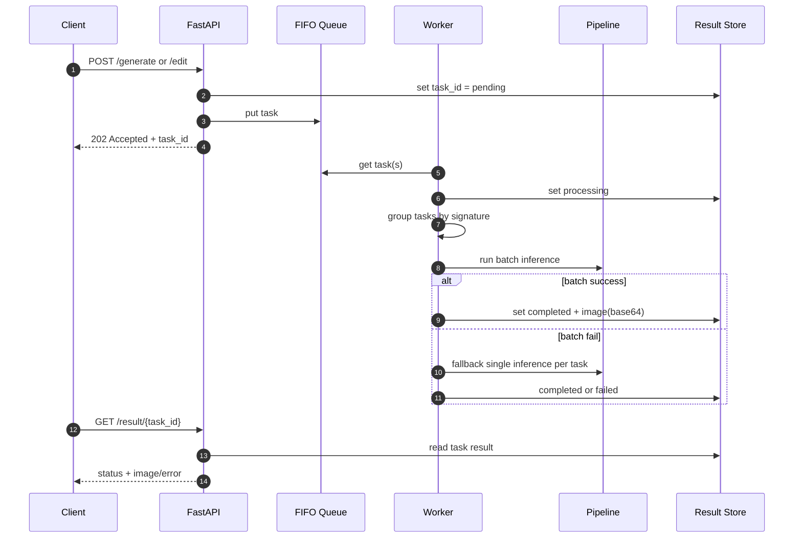

# TAI LIEU BAN GIAO DU AN IMAGE2IMAGE

## 1. Tong quan du an

Du an cung cap API Image2Image su dung FastAPI + model Flux2Klein de:
- Tao anh tu prompt (`/generate`)
- Chinh sua anh tu prompt + anh dau vao (`/edit`)

Kien truc hien tai duoc thiet ke theo mo hinh:
- API layer tiep nhan request
- Queue FIFO xu ly bat dong bo
- Worker gom batch task theo cau hinh tuong dong
- Model pipeline chay suy luan tren GPU/CPU
- Luu ket qua tam trong memory va cho client poll theo `task_id`

## 2. Pham vi va muc tieu ban giao

Tai lieu nay bao gom:
- Kien truc he thong va luong xu ly
- Huong dan cai dat, chay local va Docker
- Mo ta API endpoint, schema request/response
- Cau hinh quan trong
- Van hanh, monitor, logging, stress test
- Rui ro hien tai va de xuat sau ban giao

## 3. Cong nghe va phu thuoc chinh

- Python 3.13
- FastAPI + Uvicorn
- Diffusers (build tu source commit) + Transformers + Torch
- SDNQ (quantized matmul option)
- HuggingFace Hub (`snapshot_download`)
- Pillow, httpx, python-multipart

File tham chieu:
- `main.py`
- `src/inference.py`
- `src/queue_img2img.py`
- `src/schemas/img2img.py`
- `src/constant.py`
- `requirements.txt`

## 4. Cau truc thu muc

- `main.py`: entrypoint FastAPI, mount route, khoi tao queue + pipeline
- `src/inference.py`: load model, warmup, generate/edit single va batch
- `src/queue_img2img.py`: FIFO queue, gom batch, cap nhat state task, cleanup TTL
- `src/schemas/img2img.py`: schema request Pydantic
- `src/utils/sercurity.py`: API key auth (header)
- `src/utils/logger.py`: logging file xoay vong + console
- `public/index.html`: giao dien web co ban
- `monitor/`: script monitor va Discord alert
- `tests/`: test goi API/stress test (dang tro den URL proxy)

## 5. Kien truc he thong (Mermaid)

### 5.1 Component architecture

```mermaid
flowchart LR
		U[Client: Web/Postman/Service] -->|HTTP + API Key| A[FastAPI main.py]
		A -->|enqueue task| Q[Image2ImageQueue FIFO]
		Q -->|group by signature\noperation,height,width,guidance,steps| W[Worker]
		W --> P[Image2ImagePipeline]
		P --> M[Flux2Klein Model\nDiffusers + SDNQ]
		W -->|store status/result in memory| R[(task_results dict)]
		U -->|GET /result/{task_id}| A
		A -->|read result| R
		A --> H[/health, /tasks/stats, /tasks/pending]
```

### 5.2 Luong xu ly request bat dong bo



## 6. Luong khoi dong he thong

1. App start (`lifespan` trong `main.py`)
2. Tao `Image2ImagePipeline()`
3. Pipeline download/check model o `SAVE_MODEL_PATH`
4. Warmup 1 lan voi prompt mau
5. Tao `Image2ImageQueue(pipeline)` va start worker + cleanup task

Khi shutdown:
- Cancel worker task
- Cancel cleanup task

## 7. API contract chi tiet

Tat ca endpoint deu nam duoi `root_path=/api/v1`.
Auth bang header:
- Header name: `X-IMG2IMG-KEY`
- Value: API key dung theo cau hinh

### 7.1 Health

- `GET /health`
- Response:

```json
{
	"message": "Image2Image API is running"
}
```

### 7.2 Generate image

- `POST /generate`
- Content-Type: `application/json`
- Body:

```json
{
	"prompt": "A fantasy landscape with mountains and a river",
	"height": 1024,
	"width": 1024,
	"guidance_scale": 1.0,
	"num_inference_steps": 4
}
```

- Response (`202 Accepted`):

```json
{
	"task_id": "uuid",
	"message": "Task queued"
}
```

### 7.3 Edit image

- `POST /edit`
- Content-Type: `multipart/form-data`
- Form fields:
	- `prompt` (string)
	- `image` (file, bat buoc)
	- `height` (int, optional)
	- `width` (int, optional)

- Response (`202 Accepted`):

```json
{
	"task_id": "uuid",
	"message": "Task queued"
}
```

### 7.4 Lay ket qua

- `GET /result/{task_id}`
- Response mau khi completed:

```json
{
	"task_id": "uuid",
	"status": "completed",
	"created_at": 1710000000.0,
	"updated_at": 1710000001.2,
	"done_at": 1710000001.2,
	"image": "base64_png"
}
```

- Response mau khi failed:

```json
{
	"task_id": "uuid",
	"status": "failed",
	"error": "error detail"
}
```

### 7.5 Queue metrics

- `GET /tasks/pending`: so task dang cho trong queue
- `GET /tasks/stats`: thong ke pending/processing/completed/failed/waiting_in_queue/total_tracked

## 8. Cau hinh quan trong

Trong `src/constant.py`:

- `MODEL_ID`: repo model HuggingFace
- `SAVE_MODEL_PATH`: duong dan model local
- `HEIGHT`, `WIDTH`: kich thuoc default
- `NUM_INFERENCE_STEPS`, `GUIDANCE_SCALE`: tham so suy luan
- `QUEUE_BATCH_MAX_SIZE`: kich thuoc batch toi da
- `QUEUE_BATCH_MAX_WAIT_MS`: cua so cho gom batch
- `TASK_RESULT_TTL_SECONDS`: thoi gian luu task da xong
- `MAX_TASK_RESULTS`: gioi han so task luu trong memory
- `PORT`: cong app
- `API_KEY`, `API_KEY_NAME`: xac thuc request

## 9. Cach chay du an

### 9.1 Chay local

1. Cai dependency:

```bash
pip install -r requirements.txt
```

2. Chay API:

```bash
python main.py
```

Hoac:

```bash
uvicorn main:app --host 0.0.0.0 --port 8060 --reload
```

3. Test nhanh:
- `GET /api/v1/health`
- `POST /api/v1/generate`

### 9.2 Chay Docker

```bash
docker compose up --build -d
```

File lien quan:
- `Dockerfile`
- `docker-compose.yml`

## 10. Van hanh va giam sat

### 10.1 Logging

- Su dung `RotatingFileHandler`
- Log file: `app.log`
- Rotate: 5MB, giu 2 file backup
- Timezone log: UTC+7

### 10.2 Monitor

Thu muc `monitor/` co script:
- `health_monitor.py`: poll health endpoint dinh ky
- `discord_notifier.py`: gui alert len Discord webhook
- `state.py`: cooldown + threshold alert

### 10.3 Stress test

- `tests/test_stress_img2img.py`
- `tests/test_gen_image.py`

Luu y: 2 script test hien dang tro den URL proxy public, can doi ve moi truong muc tieu khi run noi bo.

## 11. Bao mat va khuyen nghi sau ban giao

1. API key dang dat truc tiep trong `src/constant.py`.
2. Discord webhook dang co default value trong code.
3. Khuyen nghi chuyen toan bo secret sang bien moi truong (`.env`, secret manager).
4. Khoa CORS hien la `*`, can gioi han theo domain khi len production.

## 12. Van de/rui ro da ghi nhan

1. Health monitor dang check `http://localhost:8567/health` va ky vong field `status`, trong khi app hien tai expose `8060` va tra ve field `message`.
2. Memory task result la in-memory dict: restart service se mat tat ca ket qua task dang luu.
3. Co mot so file cu/thu nghiem (`main copy.py`, `old_main.py`, file `.text`) can don dep de tranh nham lan.

## 13. Checklist ban giao van hanh

- Xac nhan may chu co GPU/driver phu hop voi Torch + CUDA
- Xac nhan dung luong dia cho model va cache
- Xac nhan API key duoc rotate va luu secret an toan
- Xac nhan endpoint health/monitor thong nhat
- Xac nhan backup log va chinh sach retention
- Xac nhan bo test smoke/stress chay thanh cong tren moi truong dich

## 14. De xuat nang cap tiep theo

1. Luu ket qua task vao Redis/PostgreSQL de ben vung qua restart.
2. Them endpoint huy task va timeout task.
3. Them metrics Prometheus (latency, throughput, queue depth, GPU memory).
4. Chuan hoa OpenAPI examples va bo integration test CI.
5. Tach config production/staging/dev.

## 15. Phu luc: vi du goi API

### 15.1 Generate

```bash
curl -X POST "http://localhost:8060/api/v1/generate" \
	-H "Content-Type: application/json" \
	-H "X-IMG2IMG-KEY: <YOUR_API_KEY>" \
	-d '{
		"prompt": "A cozy cabin in a snowy forest",
		"height": 1024,
		"width": 1024,
		"guidance_scale": 1.0,
		"num_inference_steps": 4
	}'
```

### 15.2 Poll ket qua

```bash
curl -X GET "http://localhost:8060/api/v1/result/<TASK_ID>" \
	-H "X-IMG2IMG-KEY: <YOUR_API_KEY>"
```

